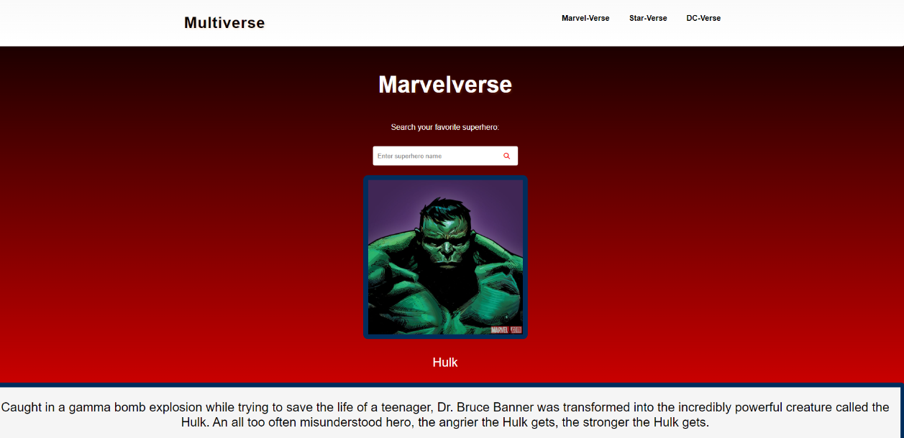
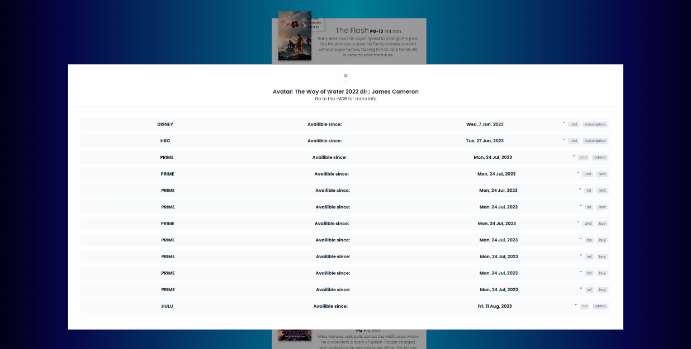
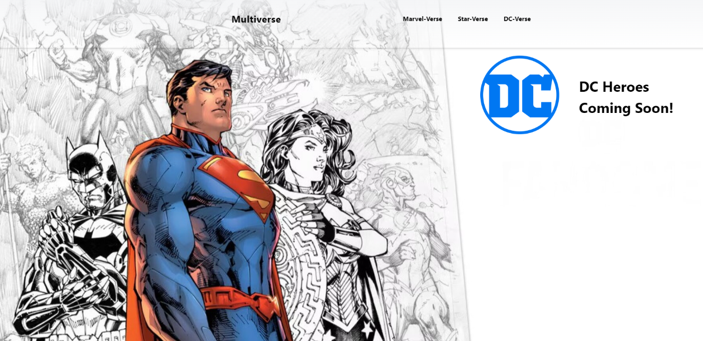

# Description

When creating this project, we set out to offer the user an intuitive way to search for information about their favorite superheroes During the development process, we gained a better understanding of server side APIs, fetch requests, using third party APIs for styling, and employing the GitHub flow and VSCode to make branches and solve merge conflicts.

# Installation

N/A: The single-page app is already deployed at GitHub pages.

## Table of Contents

- [Technologies Used](#technologies-used)
- [Screenshots](#screenshots)
- [Getting Started](#getting-started)
- [Usage](#usage)
- [Contributors](#contributors)
- [Contact](#contact)

## Technologies Used

- HTML
- CSS
- JavaScript
- API [https://developer.marvel.com/]

# Usage

You can access the single-page app here. 
- Enter the name of your favorite superhero in the search field.
- Click the "Search" button to retrieve information about the superhero.
- View the displayed information on the screen.

# Credits

The project was a collaboration between Krish, Rodrigo, Cristian and Maitree.The GitHub repo can be found at: git clone https://github.com/Cristianreyes6777/SEAL-team-6.git . There you will find links. The Normalize.

# How to Contribute

If you want to contribute, feel free to fork the repo, modify the repo and then open a pull request. That way we can review the changes before merging them in the codebase.