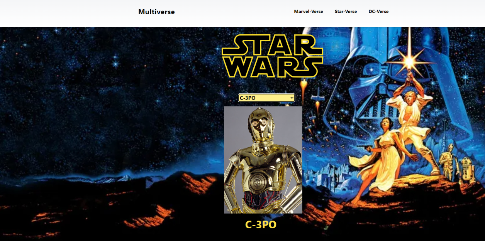

# Description

When creating this project, we set out to offer the user an intuitive way to discover high rated movies by genre and find which streaming services where currently offering it. During the development process, we gained a better understanding of server side APIs, fetch requests, using third party APIs for styling, and employing the GitHub flow and VSCode to make branches and solve merge conflicts.

# Installation

N/A: The single-page app is already deployed at GitHub pages.

# Usage

You can access the single-page app here. Using the dropdown menu, you can select a movie genre of your choosing:

. These modals open when you click the title of a movie that interests you and they show which streaming services have it on offer:

. The modals also include a link to the IMDB page for the movie:

. The app also features a "My Favorites" toggle switch, that allows you to only display movies that you deem "favorite". Here is the Favorites

button turned off: .when you click it, it turns red and the movie becomes a favourite. here is how the page looks after the "My favourit" is toggled.

. Finally, you can unselect a movie as a Favorite by clicking again on the button so it becomes gray. Due to the use of client-side storage(localStorage) the "My Favorites" list stays the same after refreshing the page.